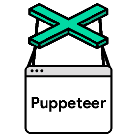

<p align="center">
  <a href="" rel="noopener">
 </a>
</p>

<h3 align="center">puppeteer-correios</h3>

<div align="center">

[]()
[](/LICENSE)

</div>

---

<p align="center"> It's a simple use of Puppeter to get a photo of a giving CEP.<br> </p>

## 📝 Table of Contents

- [About](#about)
- [Getting Started](#getting_started)
- [Usage](#usage)
- [Authors](#authors)

## 🧐 About <a name = "about"></a>

Open a headless browser go navegate to a URL of Correios and take a photo of the address found.

## 🏁 Getting Started <a name = "getting_started"></a>

These instructions will get you a copy of the project up and running on your local machine for development purposes.

### Prerequisites

Change the second param of the type function to a valid CEP to search.

```
await page.type('#endereco', '03336000');
```

### Installing

```
npm install
```

```
npm run start
```

## 🎈 Usage <a name="usage"></a>
Search a valid CEP string and take a photo of the result.

## ✍️ Authors <a name = "authors"></a>

- [@Marcel-MSC](https://github.com/Marcel-MSC) - Idea & Initial work